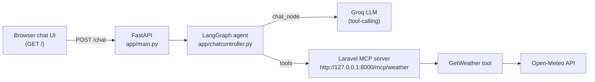

# Python Chat Agent for Laravel MCP

A small LangGraph + FastAPI chat agent built to exercise a [Laravel MCP](https://github.com/laravel/mcp) server end to end. It's not a product — it's a test harness: a real conversational client that connects to the Laravel server's `get-weather` MCP tool over Streamable HTTP, so you can confirm the tool, its schema, and the server's transport all behave correctly from an actual LLM-driven client instead of a bare MCP inspector.

## What it does

- Chats normally for small talk — no tool calls, no MCP round trip.
- Recognizes a weather question, and if no location was given, asks for one before doing anything else.
- Once it has a location, calls the Laravel MCP server's `get-weather` tool and reports back the live result (temperature, condition, how it feels).
- Keeps per-session memory, so the "which city?" follow-up lands in the same conversation.

```
You:  hi
Bot:  Hello! How can I help you today?

You:  what's the weather like
Bot:  Sure thing! Which city or location would you like the weather for?

You:  london
Bot:  In London, it's currently about 26.9°C, partly cloudy, and feels around 27°C.
```

## Architecture



The graph is two nodes: `chat_node` (the LLM, bound to whatever tools the MCP server advertises) and `tools` (a `ToolNode` that executes them). `tools_condition` routes back and forth until the LLM has enough to answer in plain text. A `MemorySaver` checkpointer keys conversation history by `session_id`, so state survives across the stateless HTTP requests FastAPI receives.

## Project structure

```
app/
  main.py            FastAPI app: lifespan startup, POST /chat, GET / (chat UI)
  chatcontroller.py   ChatController: MCP client, graph definition, system prompt
requirements.txt
.env.example          Copy to .env and fill in your key
```

## Prerequisites

- Python 3.11+ (a `venv/` is already set up in this repo)
- The Laravel MCP server running locally, e.g. `F:\Laravel\MCPServerTest`, serving `POST /mcp/weather` at `http://127.0.0.1:8000` (`php artisan serve`)
- A [Groq](https://console.groq.com/) API key

## Setup

```bash
# from the project root
venv\Scripts\python.exe -m pip install -r requirements.txt

copy .env.example .env
# then edit .env and set GROQ_API_KEY
```

## Running

1. Start the Laravel MCP server (separate terminal, in the Laravel project):
   ```bash
   php artisan serve
   ```
2. Start this chat agent (port 8001 — 8000 is taken by Laravel):
   ```bash
   venv\Scripts\python.exe -m uvicorn app.main:app --host 127.0.0.1 --port 8001
   ```
3. Open [http://127.0.0.1:8001/](http://127.0.0.1:8001/) and chat.

## Notes

- `ChatController.setup()` fetches the MCP server's tool list once at startup — if the Laravel server isn't running yet when this app boots, startup will fail. Start Laravel first.
- The model is set in `app/chatcontroller.py` (`ChatController.__init__`); swap it there if your Groq account's available models change.
- `.env` is gitignored on purpose — never commit API keys.
